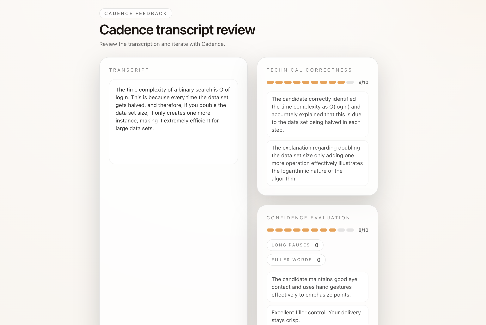
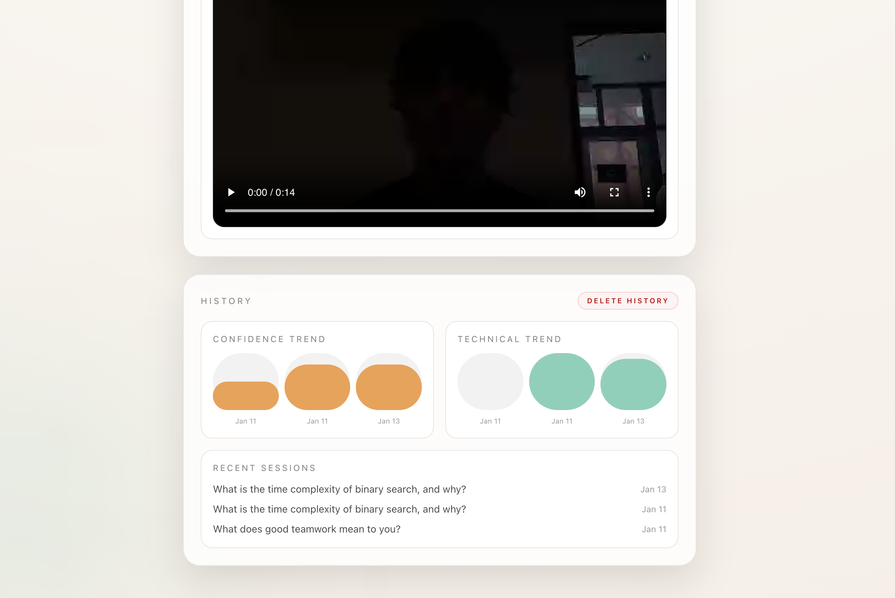

# Cadence

Cadence is a focused interview practice recorder built with Next.js + Tailwind CSS, Gemini, and TwelveLabs.


## Usage
- Open Cadence and pick a question to practice.
- Hit record, answer out loud, then stop when you're done.
- Review the transcript and scores, then retry or download your clip.

## What it does
- Records interview responses and stores clips locally in the browser.
- Uses Gemini to transcribe, score technical correctness, and count long pauses + filler words.
- Uses TwelveLabs to score delivery confidence with concise feedback.
- Lets you review results, retry a question, and download or delete clips.

## Demo
https://cadence.mihirsite.org

## Getting started
Install dependencies:
```
npm install
```

Create a `.env` file with:
```
GEMINI_API_KEY=your_key
TWELVE_LABS_API_KEY=your_key
```

Run locally:
```
npm run dev
```

Build:
```
npm run build
```

## Configuration
Optional environment variables:
AI_CALLS_DISABLED=false
```

When `NEXT_PUBLIC_AI_CALLS_DISABLED=true` or `AI_CALLS_DISABLED=true`, Cadence returns placeholder responses and skips external API calls.

## Deploy on Vercel
Deploy with the Vercel platform or your preferred host. Ensure the environment variables above are set in your deployment settings.

## More screenshots


