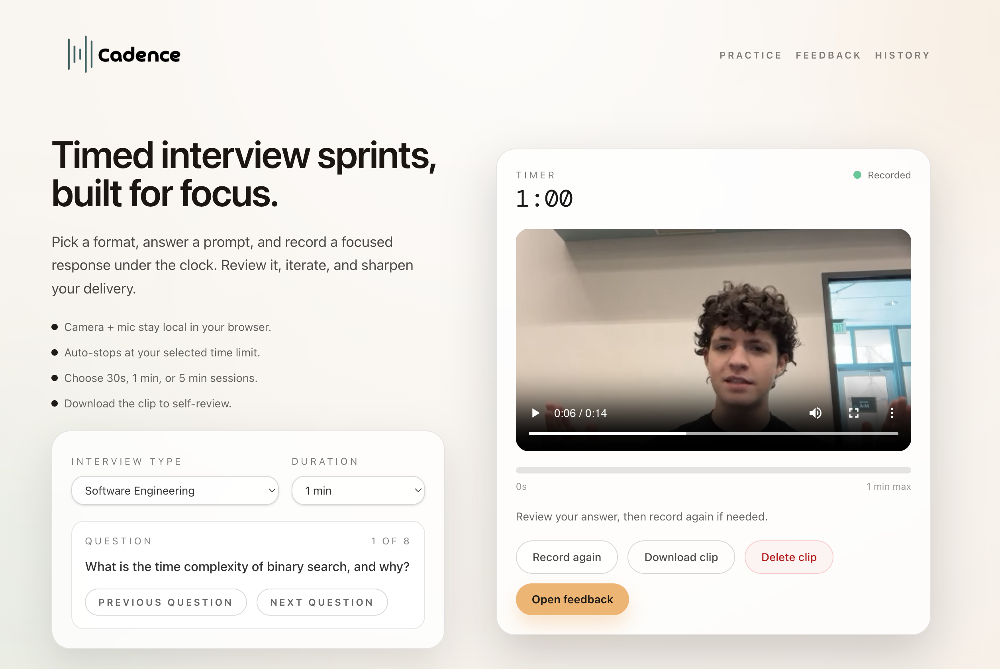
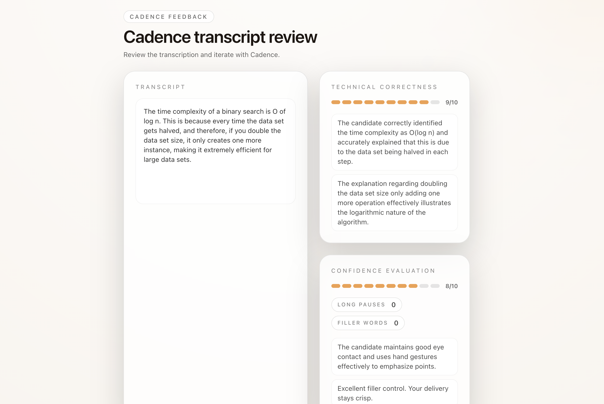
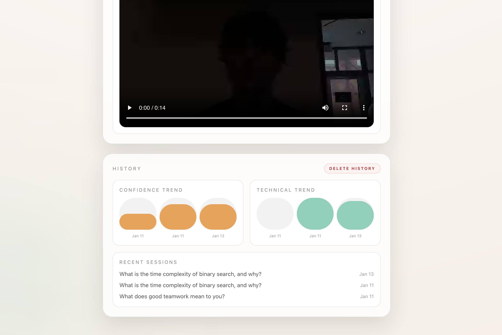

# Cadence

Cadence is a focused interview practice recorder built with Next.js + Tailwind CSS, Gemini, and TwelveLabs.



## Usage
- Open Cadence and pick a question to practice.
- Hit record, answer out loud, then stop when you're done.
- Review the transcript and scores, then retry or download your clip.

## What it does
- Records interview responses and stores clips locally in the browser.
- Finalizes browser-recorded WebM duration metadata for reliable video analysis.
- Prefers MP4/H.264 recording for native Safari playback, with WebM as a fallback.
- Uses Gemini to transcribe, score technical correctness, and count long pauses + filler words.
- Uses TwelveLabs to score delivery confidence with concise feedback.
- Deletes the temporary TwelveLabs asset after each confidence evaluation.
- Weights eye contact most heavily and caps scores for repeated or sustained gaze-away behavior.
- Lets you review results, retry a question, and download or delete clips.

## Demo
- Live Site: https://cadence.mihirdev.com
- Video Demo: https://www.youtube.com/watch?v=ujVTpeboHpI

## Getting started
Install dependencies:
```
npm install
```

Create a `.env` file with:
```
GEMINI_API_KEY=your_key
TWELVE_LABS_API_KEY=your_key
```

Run locally:
```
npm run dev
```

Build:
```
npm run build
```

## Configuration
Optional environment variables:
```
AI_CALLS_DISABLED=false
GEMINI_TRANSCRIBE_TIMEOUT_MS=85000
TWELVELABS_FEEDBACK_TIMEOUT_MS=120000
```

When `NEXT_PUBLIC_AI_CALLS_DISABLED=true` or `AI_CALLS_DISABLED=true`, Cadence returns placeholder responses and skips external API calls.
Confidence evaluation is aborted after two minutes by default instead of leaving the interface waiting indefinitely.
Cadence uploads the clip as a TwelveLabs asset and analyzes it directly with Pegasus 1.5; it does not create or poll a search index.

## Deploy on Vercel
Deploy with the Vercel platform or your preferred host. Ensure the environment variables above are set in your deployment settings.

## More screenshots


